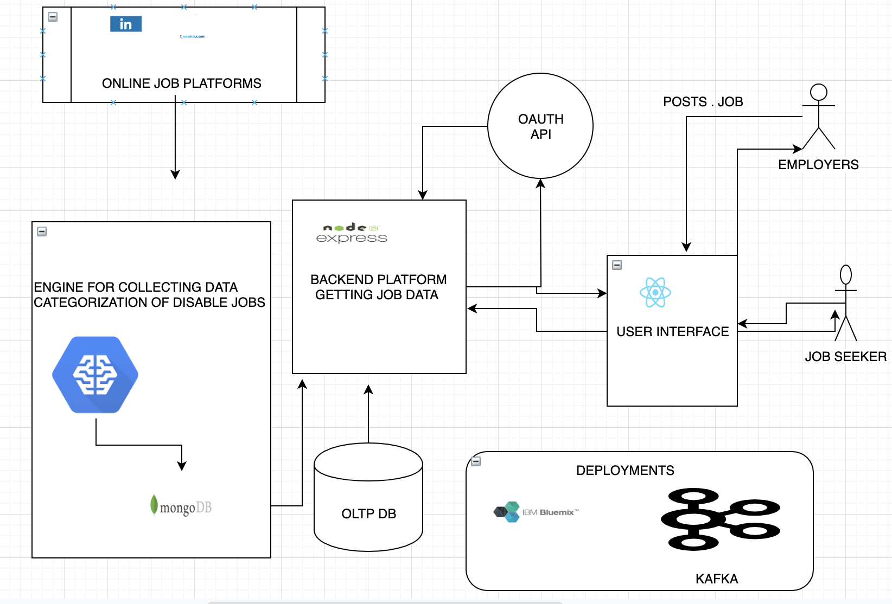

## ProjectGroup-6
#### Team Members   1. Anurag Patro   2. Bhumika Tiwari   3. Hetal Shah   4. Narisht Dhyani

### Divyang - Hiring portal for people with disabilities  (india specific)

__Problem Statement:__ 
People with disabilities (PWD) faces lots of challenges in their day to day life, one of the biggest challenges they face is employment. The average employment rate of PWD in India is 0.28 percent in the private sector and 0.54 percent in the public sector. Findings of the World Bank Report ‘People with Disabilities in India: From Commitments to Outcomes’ released in 2007, suggest that the employment rate of disabled people has actually fallen from 42.7% in 1991 down to 37.6 % in 2002. The International Labour Organization (ILO)'s 2011 report 'Persons with Disability and The India Labour Market: Challenges and Opportunities' states that 73.6% of the disabled in India are still outside the labour force.
One of the major reasons of the above-mentioned challenges is unavailability of dedicated platform of job search for PWD. There is a dire need of one platform for PWD where employers can post jobs for them. This would facilitate the PWD in finding relevant job postings and apply to the ones that they find of their interest.

__Proposed solution:__
Job searching is hard enough, but even more so when you have a disability. Fortunately, we are here to 
help. We at Divyang, provide a job portal specifically targeting people with disability and helping them connect with employers hiring in their field of interest. We plan on creating a user interface, where it is easier for job seekers to find opportunities seamlessly and also get job alerts emailed to their inbox. We also plan on using external API’s and machine learning algorithms, which would look through targeted website and find out jobs listed for people with disability, thereby making our website a one stop place for people looking for jobs. We are also thinking of using a job recommendation engine running on collaborative filtering and other machine learning algorithms, which will tailor job alerts as per the user profile and interests, by leveraging data from other similar user profiles

__Architecture:__

__Technology Stack:__ Node JS,Express, OAuth, OLTP, MySQL, React, Express, Machine Learning, Natural Language Processing,MongoDB, IBMBluemix,Kafka,CSS 

